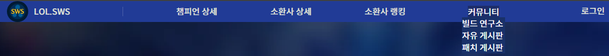
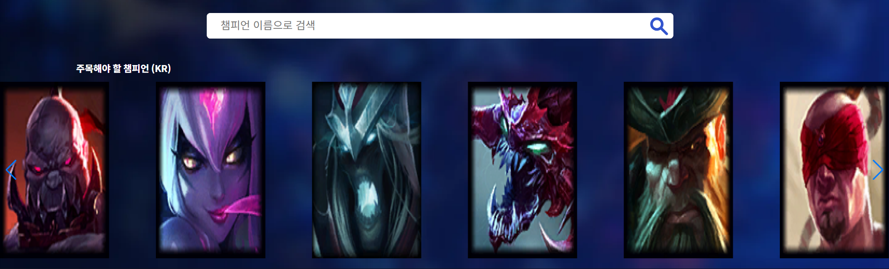
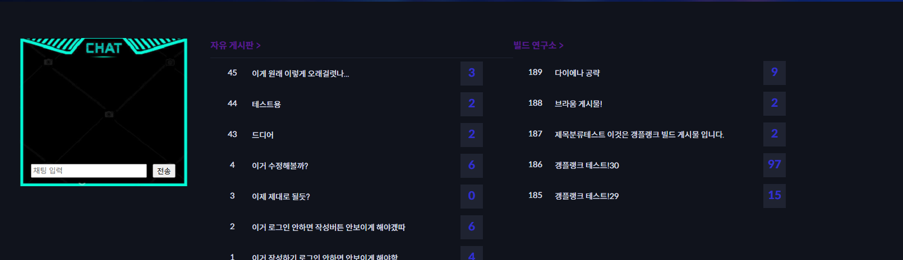

리드미

저희 코드를 확인해 주셔서 감사합니다.

sws프로젝트의 주제는 간단한 전적검색, 랭킹 조회, 게시판을 이용한 커뮤니티등

가벼운 주제로 만들어진 사이트 입니다.

사이트의 정보는 라이엇에서 제공하는 api를 사용하여 구동되며

api키가 만료되거나 오류시 db에 저장된 값들을 화면에 보여주고 있음을 알려 드립니다.

실제 운영(api사용)되고있는 주소도 올려 드리오니 확인해보시면 좋겠습니다.

확인하고 계신 코드를 받아서 사용해 보고 싶으시다면

설정 방법에 대해 안내 드리겠습니다.

1. 화면 비율은 1920 X 1080으로 이용해주세요

2. application,properties에 riot.api.key = '발급받으신 api키' 를 추가해주세요
 -> api 키 발급 받기 (https://developer.riotgames.com/)에 방문하시어 로그인 후 발급 (일반유저는 24시간의 유효기간을 가집니다)

3. 구글로그인 api사용시 id를 발급받고 secret코드도 받으셔야 쓸 수 있습니다. 

4. 코드를 실행해 보시면 저희의 작업물을 확인하실 수 있습니다.

-----------------------------------------홈화면-----------------------------------------------

1. 홈 화면 상단

   1). 홈화면의 상단 메뉴로 대부분의 화면에 네비게이션처럼 상단에 고정되어 페이지 이동간의 편의를 제공 
   
   2). 로그인시 로그인 버튼이 없어지고 마이페이지와 로그아웃 버튼으로 바뀜

2. 홈 화면 검색창(챔피언검색) 및 스와이퍼를 이용한 챔피언 승률

   1). 검색창에 챔피언 이름 검색시 챔피언 상세보기 페이지로 이동함
   
   2). api를 사용해 로테이션 챔피언을 띄워주고 해당 챔피언의 승률을 간단히 보여줌
   
   - 마우스 올리면 스와이퍼가 멈추고 해당 챔피언 정보 표출 그리고 버튼 클릭시 해당 챔피언 상세로 이동

3. 홈 화면 웹소캣 게시판

   1). 홈하단의 웹소캣을 이용한 실시간 채팅과 게시판 미리보기(최신글 기준)

