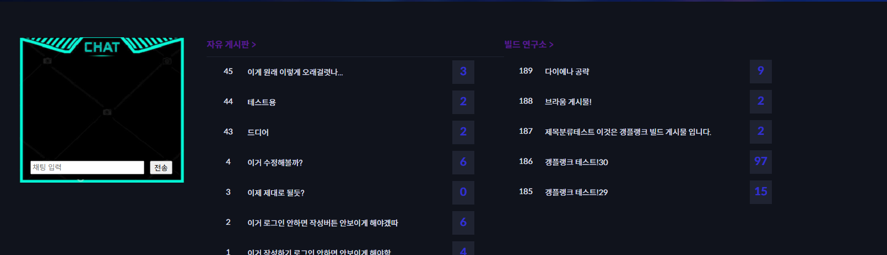

# 🎮 sws 프로젝트

저희 코드를 확인해 주셔서 감사합니다.

`sws` 프로젝트는 **간단한 전적 검색**, **랭킹 조회**, **게시판 기반 커뮤니티**, **웹소켓 채팅** 기능 등을 포함한 웹사이트입니다.

사이트는 **Riot Games API**를 활용하여 동작하며, **API 키가 만료되거나 오류가 발생할 경우 DB에 저장된 캐시 데이터**를 대신 출력합니다.

🚀 실제 운영 중인 사이트 주소도 첨부해두었습니다. 확인해보시면 더 좋습니다!

---

## ⚙️ 실행 전 설정 방법

1. **해상도**: 1920x1080로 사용을 권장합니다.  
2. **application.properties 설정**:
   ```properties
   riot.api.key=발급받은_라이엇_API_키
   ```
   - [Riot 개발자 포털](https://developer.riotgames.com/)에서 로그인 후 발급 (일반 키는 24시간 유효)
3. **구글 로그인 API 사용 시**:  
   - Google Developer Console에서 **Client ID** 및 **Secret 코드** 발급 필요
4. 실행 후 사이트를 통해 저희의 기능들을 확인하실 수 있습니다.

---

# 📸 주요 화면 소개

## 🏠 홈 화면

### ● 상단 고정 메뉴  
  
- 모든 페이지에 고정  
- 로그인 시 `마이페이지 / 로그아웃` 노출

---

### ● 챔피언 검색 & 스와이퍼  
  
  
- 챔피언 검색 → 상세 페이지로 이동  
- 로테이션 챔피언 & 승률 출력  
- 마우스 오버 시 정지 + 정보 출력  
- 클릭 시 상세 보기

---

### ● 웹소켓 게시판  
  
- 실시간 채팅  
- 최신 글 미리보기  

---

## 💡 챔피언 상세

  
- 검색 및 네비게이션  
- 챔피언 승률, 아이템, 룬, 스킬 트리 등 요약 제공

---

## 🧙‍♂️ 소환사 상세

  
  
- 소환사 정보, 전적, 최근 게임 내용, 실시간 채팅 포함

---

## 🏆 소환사 랭킹

  
- 최대 300명 랭킹 조회 (무한 스크롤 방식)  
- 실시간 채팅 가능  
- 갱신 버튼 클릭 시 alert + 로딩 표시

---

## 🛠️ 빌드 게시판

  
  
  
  
  
- 작성, 상세, 목록 확인 가능  
- Toast UI 마크다운 에디터 사용

---

## 🗣 자유 게시판

  
- 제목/내용 검색 기능  
- 실시간 채팅  
- 게시글 클릭 시 상세 보기 + 조회수 증가  
- 페이지네이션(10개씩)

---

### ● 상세 보기  
  
  
- 추천/비추천 (중복 불가)  
- 댓글 등록 및 삭제 (작성자만 삭제 가능)  
- 이미지 포함 시 뷰어 출력

---

### ● 게시글 작성  
  
  
- 마크다운 + 프리뷰 2분할  
- 카테고리 클릭 시 AJAX로 이미지 로드  
- 이미지 클릭 → 마크다운 자동 삽입

---

## 🛠 패치 게시판

  
  
  
  
- 게시글 목록, 상세 보기, 작성 기능 포함  

---

## 🔐 로그인 & 회원관리

  
  
  
- 이메일 기반 로그인/회원가입/비번 초기화 구현  
- 인증 메일 발송 및 토큰 기반 재설정 기능

---

## 👤 마이페이지

  
- 닉네임 변경  
- 비밀번호 변경  
- 회원 정보 수정  

---

감사합니다 🙇
